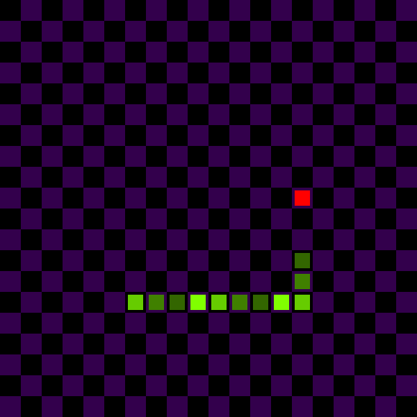

# Snake Game



Um versão do Jogo da Cobra feita com OpenGL e C++. Esse foi um pequeno projeto de prática que também me deu a oportunidade de pesquisar e aprender sobre padrões de design, como "Observer" e "Command".

## Como usar

- Clone o repositório localmente
- Crie um diretório `build`
- Abra o terminal no diretório `build`
- Execute os seguintes comandos:
   ```bash
   cmake ..
   make
   ```

## Feito Com

- OpenGL - API multi-plataforma para renderizar gráficos 2D e 3D
- C++ - Linguagem de programação de alto nível
- CMake - Ferramenta multi-plataforma para gerar arquivos de sistemas de build

## TODO

- [ ] Adicionar opção de reiniciar partida
- [ ] Adicionar textos para orientação e para indicar o estado do jogo
- [ ] Adicionar elementos de GUI
- [ ] Adicionar um menu inicial